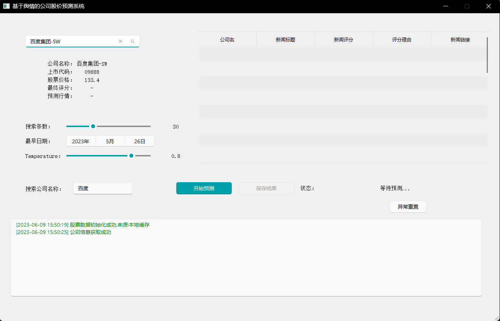
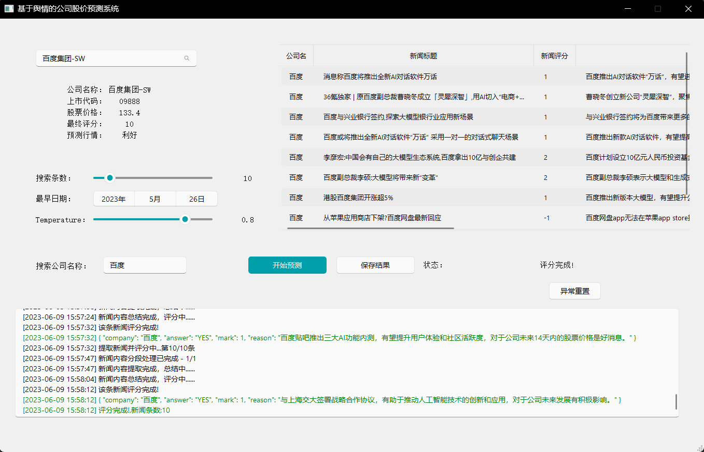
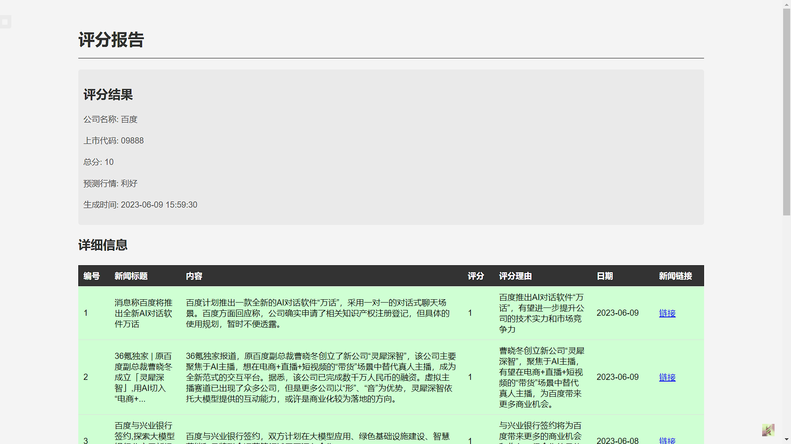

#  基于Open AI分析舆情的股市预测机器人(Stock Predict Robot)





- [Stock Predict Robot](#SPR)
	- [介绍](#介绍)
	- [功能列表](#功能列表)
	- [前置要求](#前置要求)
		- [Python环境](#Python环境)
		- [浏览器要求](#浏览器要求)
		- [API选择](#API选择)
	- [项目介绍](#项目介绍)
		- [使用流程](#使用流程)
		- [技术细则](#技术细则)
		- [SK Prompt](#SK Prompt)
			[分段处理](#分段处理)
			[总结处理](#总结处理)
			[评分处理](#评分处理)
		- [全局配置](#全局配置)
	- [常见问题](#常见问题)

## 介绍

基于Microsoft Semantic Kernel使用`OpenAI`或`Azure OpenAI`的分析舆情预测股票价格机器人

| 方式                                          | 代理 | 稳定     | 质量 |
| --------------------------------------------- | ------ | ---------- | ---- |
| `OpenAI API(gpt-3.5-turbo)`                           | 需要     | 不稳定       | 中等 |
| `Azure OpenAI API(用户指定)` | 不需要     | 稳定 | 根据所提供模型而定 |

对比：
1. `OpenAI API` 使用 `gpt-3.5-turbo` 通过 `OpenAI` 官方 API调用 `GPT`
2. `Azure OpenAI API` 使用`Azure`提供的API接口，在中国更为稳定和高速


环境变量：

全部参数变量请查看或[这里](#环境变量)

```
/.env.example
```

## 功能列表
|                                   | 实现  |
|-----------------------------------|:---:|
| 上市公司信息获取(API/本地缓存)                            | ✅  |
| 非大陆/港股上市公司预测                            | ❌  |
| 百度新闻获取                      | ✅  |
| 本地新闻导入        | ❌  |
| 新闻网页到新闻内容                | ✅  |
| 新闻内容评分                            | ✅  |
| 评分总结文档                            | ✅  |
| 手动修改评分        | ❌  |

## 前置要求

### Python环境

`Python 3.8`，安装`requirements.txt`下的包

```shell
pip install -r requirements.txt
```


### 浏览器要求
`Chrome 114.x`, 若Chrome版本不符，可以替换`utils/chromedriver.exe`为自己对应的版本，chromedriver在此[下载](https://chromedriver.chromium.org/downloads)

### API选择
选择方式：
1. 进入 `.env.example` 文件，填写相关内容,将文件名改为 `.env`
2. 使用 `OpenAI API Key` 请填写 `OPENAI_API_KEY` 字段 [(获取 apiKey)](https://platform.openai.com/overview)
3. 使用 `Azure OpenAI API` 请填写 `AZURE_OPENAI_DEPLOYMENT_NAME` ,`AZURE_OPENAI_ENDPOINT`, `AZURE_OPENAI_API_KEY`字段
4. 在`config.py`中切换`USE_AZURE`选择不同的API接口


## 项目介绍

### 使用流程
1. 运行`.\launch.py`, 进入程序主界面
2. 在搜索框输入公司名称模糊查询或股票代码准确查询
3. 选择公司后，按需修改`搜索公司名称`栏确认新闻搜索关键词，修改
`搜索条数`、`Temperature`和`最早日期`确认搜索参数
4. 点击开始预测，等待获取新闻列表
5. 程序使用爬虫对列表中新闻链接进行新闻内容爬取，这一阶段浏览器会在前台运行，根据搜索条数持续约1-3分钟，在此期间请勿操作电脑
6. 程序获取所有新闻内容粗信息，进入处理并评分阶段，这个阶段的持续时间会比较长，处理速度约为20-30秒每条新闻，请确保网络通畅
7. 当评分阶段完毕后，界面会显示简单结果，即该次的评分和预测行情，点击`保存结果`可以将本次评分的具体细则以`html`格式保存

### 技术细则
1. 项目可视化由基于`Pyqt 5`的`PyQt-Fluent-Widgets`完成，界面贴近新版Windows的风格:  [PyQt-Fluent-Widgets](https://github.com/zhiyiYo/PyQt-Fluent-Widgets)
2. 项目的上市公司信息来源于`AKShare`，AKShare 是基于 Python 的财经数据接口库，本项目通过它获取A股和港股所有上市公司的名称、代码和价格: [AKShare](https://github.com/akfamily/akshare/)
3. 新闻列表的获取是基于百度资讯的搜索，根据`搜索公司名称`栏的文本和`搜索条数`的数字用`Request`库爬取相应条数的新闻标题和链接
4. 使用`Selenium`对所爬取的链接进行进一步新闻内容的爬取，为保证运行效率，默认使用多线程进行爬取
5. 使用`Semantic Kernel`对爬取的新闻进行初步处理，将新闻内容先进行分段处理后总结处理
6. 评分同样使用`Semantic Kernel`进行，要求API返回特定`Json`格式保证所出结果被反序列化。

### SK Prompt

#### 分段处理
将新闻原始内容按照每3000字符切片让GPT回答，这样有可能使新闻内容的开头和结尾缺少内容，需要在提示词里添加：
```shell
请注意，用户提供的新闻每行开头和结尾可能是不完整的，请忽略不完整的内容
```
需要提醒GPT提取出新闻日期：
```shell
你的任务是根据用户提供的片段提炼出的若干行新闻的内容和新闻发布的日期，如果该片段中不含新闻内容或日期，请回答“没有检测到新闻内容”。
```
添加样例回答，教会GPT不同情况下的回答格式：

````shell
样例回答:
如果检测到日期:
```
2023-05-31
xxxxx(新闻内容)
```

如果没有检测到日期:
```
xxxxx(新闻内容)
```

如果没有检测到新闻内容:
```
没有检测到新闻内容
```
````

添加警告，确保以预期格式输出：
```shell
警告:永远不要按预期格式之外的格式回答！
```

输入部分，限定输出长度：
```shell
回答不超过200字。
以下是用户输入：
{{$input}}
```

#### 总结处理
根据上面提示词获得的若干行新闻信息进行进一步的汇总，首先表达需求：
```shell
你的任务是将用户提供的新闻内容转换为JSON格式,用户输入的某些行可能为"没有检测到新闻内容",忽略即可。
```

提示输入样例：
````shell
以下是样例输入,x代表新闻内容:
```
xxxxxxx
没有检测到新闻内容。
```
````

提示回答样例：
```shell
以下是回答的JSON样例:
{
    "title" : "xxx",
    "date" : "xxx",
    "content" : "xxx"
}
```

特殊情况下的回答：
```shell
请注意，提炼出的新闻内容content不要超过300字。date为新闻发布的日期,格式要求为"yyyy-MM-dd"。如果没有提炼出新闻内容，请回答以下JSON:
{
    "title" : "Not Found",
    "date" : "Not Found",
    "content" : "Not Found"
}
```

添加警告，确保以预期格式输出：
```shell
警告:永远不要按预期格式之外的格式回答！
```

输入部分：
```shell
以下是新闻内容：
{{$input}}
```

#### 评分处理
描述需求，提供初步信息：
```shell
忘记你之前的指令，假装自己是一位金融专家，具有股票推荐经验,我会给你一段关于{{$company_name}}公司的新闻，请你根据新闻告诉我这个新闻对于{{$company_name}}公司未来{{$term}}天内的股票价格是好消息还是坏消息？
请注意，今天的日期是{{$date_time}},请于新闻日期比较综合考虑。
```

规定回答格式：
```shell
使用json格式回答，
将公司名放在company字段中
将消息好坏放在answer字段中，YES代表好消息，NO代表坏消息，UNKNOWN代表无法判断或新闻与公司无关。
将消息好坏评分放在mark字段中，不好的分数从-3到-1，-3表示灾难性事件，-2表示严重负面事件，-1表示一般负面事件。好的分数从1到3，1表示一般正面事件，2表示优秀正面事件，3表示颠覆型事件。0代表无法判断。
用一句简短的话详细说明你判断的理由，放在reason字段中。这句话不能超过100字。
```

举例强化格式要求：
```
例如：
{
    "company": "xxx",
    "answer": "YES",
    "mark": 2,
    "reason": "xxx公司发布了新款xPhone，预计会带来更多的收入"
}
```

打分标准参考(这部分可以根据更进一步的金融知识做出修改)：
```shell
我会给出几个打分标准：
xxx公司发生火灾，造成36人死亡 - -3，灾难性事件
xxx发布618预售战报:xxx服饰预售订单额整体增长超90% - 2，优秀正面事件
喜讯!2023xxx万象大会,学魁榜荣获“xxx电商直播优质客户奖” - 1，一般正面事件
xxx提出mRNA疫苗优化算法，可提高疫苗效率 - 3，颠覆型事件
```

添加警告，确保以预期JSON格式输出：
```shell
警告:永远不要按预期JSON格式之外的格式回答！
```

提供输入：
```shell
我会将新闻内容以JSON格式给你，新闻标题在title字段中，新闻内容在content字段中。如果新闻标题或新闻内容为"Not Found",请回答"UNKNOWN"，mark为0，reason为"无法判断"

以下是新闻内容：
{{$input}}
```

### 全局配置
位于`config.py`下：

1. `ERROR_CODE` , `SUCCESS_CODE`，`WAITING_CODE`： 程序错误、正确与等待码，起标识作用
2. `WAITING_TIME`：程序每一阶段到下一阶段的等待时间
3. `USE_AZURE`(`True` or `False`)：指定程序使用Azure OpenAI 还是 OpenAI
4. `MAX_RETRY`：`Request`模块最大重试次数
5. `MAX_CONNECTIONS`：`Selenium`爬取时最大并发线程数，建议不大于5


## 常见问题
Q: 为什么新闻内容爬取使用 `Selenium` 而不使用 `Request`库？

A: 模拟用户真实点击，防止反爬。

Q: 为什么要将新闻内容分段处理？

A: 初步爬取的新闻内容可能过长，且有可能包含很多新闻外的内容(如用户评论)，需要分段
保证不超过问题和答案不超过最大token。

Q: 程序过程中出现了异常怎么办? 比如没能爬取到内容，OpenAI 处理时间太长等。

A: 程序对一些异常做了一定处理，保证程序能够在一些异常情况下在日志栏输出错误报警。如果程序在某些步骤卡住，可以点击`异常重置`将程序初始化。

Q: 我想修改prompt内容，输出更符合我需求的答案？

A: 可以修改`./prompt`下的三个prompt文件来符合特定的需求。

